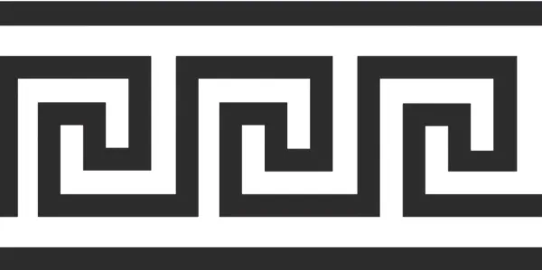
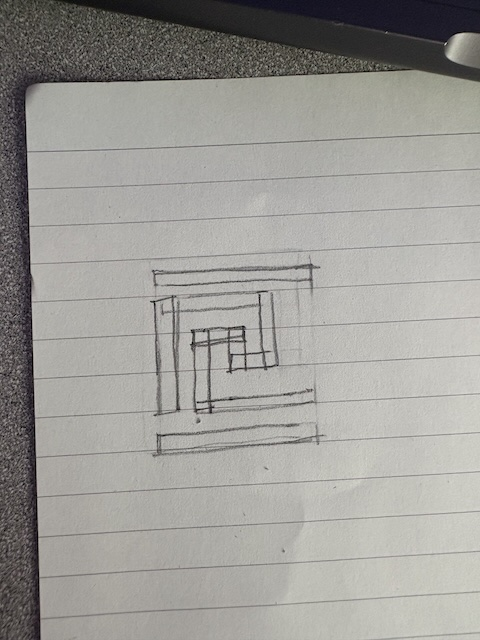
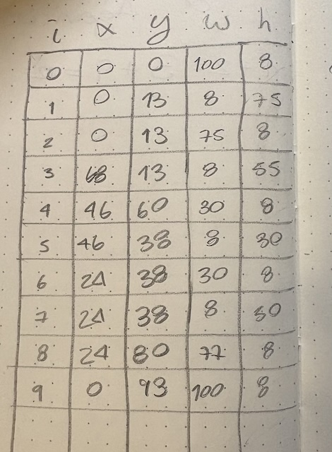

# Midterm Project Documentation Log

### Phase 1: Sketch Your Visual Object

- I searched for tile designs on google, I considered doing a celtic knot as my tile but when I asked Prof. Rachel to approve she told me it would be too difficult. 
-  I searched for something easier and settled on this greek key meander pattern from [this](https://greekerthanthegreeks.com/the-origins-and-meaning-of-the-greek-key-meander-pattern/) web page. 
- 
- I asked Prof. Rachel and she agreed this time. 
- I drew the following picture, drawing out every individual shape so I know how many shapes I have and what kind of functions I would need to use. 
-  

### Phase 2: Translate to P5.js Sketch

- I looked for the best function to use for my tile in the [reference section](https://p5js.org/reference/) of `p5.js. I found I needed to use the [`rect() function`](https://p5js.org/reference/p5/rect/).

- I tried figuring out a different way to draw my tile without using 10 `rect()` functions in class but couldnt figure it out. I literally couldnt think of a way to do it I didn't even write any code :((...

- I tried again at home but I was still running into some trouble with just the logic of it without writing any code, so I decided to start from the beginning and go from there. 

- I used [pixilart](https://www.pixilart.com/draw?gad_source=1&gad_campaignid=22681427954&gbraid=0AAAAADQsr1CfFXz2HwZwykNjCAY3WUcAy#) to draw my shape out in a 100 x 100 grid so I could get the x and y coordinates, as well as the height and width of the shapes, easier. 
- I made a list of all my rectangles with the values I needed for the function. (x, y, w, h)

- 

- I wrote out the code to draw my shape in `p5.js`:
	- starting with:
	   
	 ```javascript
		function setup(){
			createCanvas(100, 100);
			noStroke();
		}
	```
- as we learned in class to create the canvas and `noStroke` to avoid the strokes 	showing. 
	
	- then I went into writing the code to draw the tile. 
	- I used 
	
	```javascript
		
		function draw(){
			background(200);
			fill(0)
		}
	```
	- to set up the background and color of my shapes as we did in class before, I just 	wanted to set up the function without worrying about colors so I chose the same ones we 	used in class. 
	
	- then I started setting up my `rect()` functions. 
		
	```javascript
		
		rect(0, 2, 100, 8);
		rect(0, 13, 8, 75);
		rect(0, 13, 75, 8);
		rect(68, 13, 8, 55);
		rect(46, 60, 30, 8);
		rect(46, 38, 8, 30);
		rect(24, 38, 30, 8);
		rect(24, 38, 8, 50);
		rect(24, 80, 77, 8);
		rect(0, 91, 100, 8);
	```
	
	
	- I tested it in `p5.js` to see if it worked and it looked fine but I wanted it to be a little more colorfull so I looked in the [reference section](https://p5js.org/reference/) of `p5.js` how to choose a fill color that isnt greyscale. I learned how to use the [`color()`](https://p5js.org/reference/p5/color/) function and wrote the following code into the start of my `draw()` function, right after the background.

	```javascript

		let c = color(#2f3699);
		fill(c);

	```
	
	- I kept getting `SyntaxError` when I tested the code in `p5.js`, so I tried using the RGB values but it kept showing as greyscale still so I went back to read the reference and realized I was missing single quotes around the hex value of the color I wanted to use. So I changed the code to: `let c = color('#2f3699');`
	
	- I tested it and it worked. But I didn't like the background color anymore so I changed it to 240 so it is lighter. 
	
	- I ended with the following code: 
		
	```javascript
	
		function setup() {
			createCanvas(100, 100);
			noStroke();
		}
		
		function draw(){
			background(240); 
			let c = color('#2f3699');
			fill(c);
			rect(0, 0, 100, 8);
			rect(0, 13, 8, 75);
			rect(0, 13, 75, 8);
			rect(68, 13, 8, 55);
			rect(46, 60, 30, 8);
			rect(46, 38, 8, 30);
			rect(24, 38, 30, 8);
			rect(24, 38, 8, 50);
			rect(24, 80, 77, 8);
			rect(0, 93, 100, 8);
		}
	```

### Phase 3: Function
- I read the Phase 3 instructions in the `README` document in the `06Midterm` folder in the `261fa25` repository. 

- after I read the instructions I used the example from line 69 in the same document as a guide to follow the instructions. 
	
	- I wrote the following code with that guide: 
		
	```javascript

		function drawObject(x, y, s) {
			translate(x, y);
			scale(s);
			background(240); 
			let c = color('#2f3699');
			fill(c);
			rect(0, 0, 100, 8);
			rect(0, 13, 8, 75);
			rect(0, 13, 75, 8);
			rect(68, 13, 8, 55);
			rect(46, 60, 30, 8);
			rect(46, 38, 8, 30);
			rect(24, 38, 30, 8);
			rect(24, 38, 8, 50);
			rect(24, 80, 77, 8);
			rect(0, 93, 100, 8);
			}
			
			function draw() {
				drawObject(20, 0, 1);
				drawObject(40, 10, 0.2)
			}
	```


	- I tested a few values in the `drawObject` functions to see the result and moved on to adding the `push()` and `pop() functions as outlined in the instructions. Ended with the following code:
	
	```javascript

			function setup() {
				createCanvas(100, 100);
				noStroke();
			}
			
			function drawObject(x, y, s) {
				push();
				translate(x, y);
				scale(s);
				background(240); 
				let c = color('#2f3699');
				fill(c);
				rect(0, 0, 100, 8);
				rect(0, 13, 8, 75);
				rect(0, 13, 75, 8);
				rect(68, 13, 8, 55);
				rect(46, 60, 30, 8);
				rect(46, 38, 8, 30);
				rect(24, 38, 30, 8);
				rect(24, 38, 8, 50);
				rect(24, 80, 77, 8);
				rect(0, 93, 100, 8);
				pop();
			}
			
			function draw() {
				drawObject(20, 0, 1);
				drawObject(40, 10, 0.2);
			}
	 ```

- (I'm so sorry I tried so many different things to try to make this code readable in the preview as a code block but it just isnt working and I can't figure out why... I even wrote the code without copy and pasting anything and it's still not working idk :((...)

- (I FIXED IT :D I DONT KNOW HOW! I ACCIDENTALLY TABBED AND IT FIXED IT!! leaving this here so I remember to ask Prof. Rome what happened... and how to fix it in the future)	

- (It stopped working and kept showing random strings of numbers and letters I'll just leave it alone and ask later)

### Phase 4: Tiling

- I read the instructions in the `README` document in the `06Midterm folder in the `261fa25` repository.

- After making sure I understood the instructions I tried just tiling the image with for statements. 

	- I changed the canvas size in the code to 500 x 500 and used the following code to make a loop to tile the image in a 5x5 grid:
	
	```javascript
		
			
			function draw() {
				for (let y = 0; y < 500; y += 100) {
					for (let x = 0; x < 500; x += 100) {
						drawObject(x, y, 1);
					}
				}
			}
		

	```

	- I used the for loops in the `codealong.js` files in `03Operators&Bindings` and `04ControlFlow` folders in the `261fa25` repository as guides to make sure I was nesting them correctly. 
	
	- I tested it with the code from phase 3 and it tiled perfectly, but I need the code to be adaptable to different grid sizes like in the example. 
	
	- I switched the numbers in `y < 500` and `x < 500` for height and width respectively. 
	
	- I defined `tileSize` as `width` divided by the grid size that I input. The code looked like this: `let tileSize = width / 5`
	
	- I defined `s` as the `tileSize` divided by 100 which is the original size in pixels of my tile. It looked like this: `let s = tileSize / 100`
	
	- I also replaced the number I was adding to `y` and `x` at the end of my for statements with `tileSize` so it would be easier to modify everything at the same time. 
	
	```javascript
	  
		function draw() {
			 background(240);
			 let tileSize = width / 5;
			 let s = tileSize / 100; 
			 
			 for (let y = 0; y < height; y += tileSize) {
				 for (let x = 0; x < width; x += tileSize) {
					 drawObject(x, y, s);
				 }
			 }
		 }
		 
	```
	- I tested it and it ran ok. 
	
	- I need to be able to switch between grid sizes (also I want it to be interactive sort of)
	
	- I defined `grid` in the `draw()` function as a prompt to ask for the grid size with `let grid = prompt("Enter grid size (e.g., 4 for a 4x4 grid):", "4");`
	
	- Replaced the number in `tileSize` with `grid`. `let tileSize = width / grid;`
	
	- Tested, it works but the prompt window comes back immediately. I probably just need the prompt to be outside of the `draw()` function so it stops looping with the for loop. 
	
	- I defined `grid` before the `draw()` function as a prompt to ask for a grid size. Same code as above: `let grid = prompt("Enter grid size (e.g., 4 for a 4x4 grid):", "4");`
	
	- This is what I end up with:
	 
	```javascript	
	 	
		let grid = prompt("Enter grid size (e.g., 4 for a 4x4 grid):", "4");
		function draw() {
			background(240);
			let tileSize = width / grid;
			let s = tileSize / 100; 
			
			for (let y = 0; y < height; y += tileSize) {
				for (let x = 0; x < width; x += tileSize) {
					drawObject(x, y, s);
				}
			}
		}
		
		
	 ```
	- I test it and it runs ok. 
	
	- I didn't like the way the top and bottom lines fused and made wider lines in the middle of the grid so I changed the `y` value in the `rect()` function for the top and bottom lines so that there is a space between them. Full final list with the functions: 
	```javascript
	
		rect(0, 2, 100, 8);
		rect(0, 13, 8, 75);
	    rect(0, 13, 75, 8);
	    rect(68, 13, 8, 55);
	    rect(46, 60, 30, 8);
	    rect(46, 38, 8, 30);
	    rect(24, 38, 30, 8);
	    rect(24, 38, 8, 50);
	    rect(24, 80, 77, 8);
	    rect(0, 91, 100, 8);
	
	```
	
	- this was exhausting but very fun!! I don't know what I'm doing wrong when I was trying to make code blocks on this document :((. I ended up copying Prof. Rome's syntax and that worked... sort of. 
